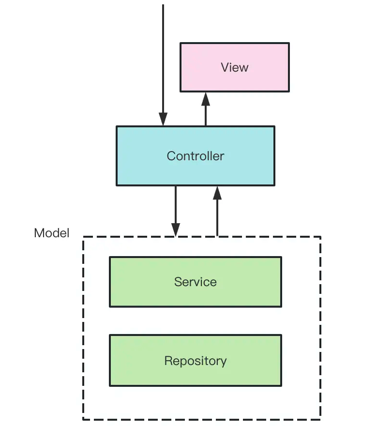
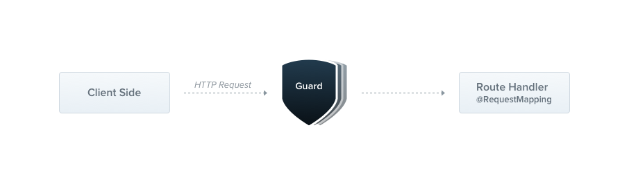

## AOP

Nest 使用的是 MVC 架构。在 MVC 架构下，请求会先发送给 Controller，由它调度 Module 层的 Service 来完成业务逻辑，然后返回对应的 View。



在这个流程中，Nest 还提供了 AOP 的能力。

Nest 在调用 Controller 之前和之后增加了执行通用逻辑的阶段。如果要在调用链路里加一段通用逻辑（比如：日志、权限、异常处理等），就可以在这个阶段去添加。


这种横向的扩展点就叫做切面，能透明的加入切面逻辑的编程方式就叫 AOP（面向切面编程）。

AOP 的好处是可以把一些通用逻辑分离到切面中，保持业务逻辑的存粹性，这样切面逻辑可以复用，还可以动态的增删。

### Nest 中的 AOP

Nest 中实现 AOP 的方式一共有五种：Middleware、Guard、Pipe、Interceptor、ExceptionFiler。

#### Middleware

Nest 的底层是 Express，自然也可以使用中间件，但是做了进一步的细分，分为全局中间件和路由中间件。


通过类定义的中间件支持依赖注入，需要实现 `NestMiddleware` 接口。

```typescript
import { Request, Response, NextFunction } from 'express';

@Injectable()
export class LoggerMiddleware implements NestMiddleware {
  use(req: Request, res: Response, next: NextFunction) {
    console.log('Request...');
    next();
  }
}

// 模块作用域
@Module({
  imports: [],
  controllers: [AppController],
  providers: [AppService],
})
export class AppModule implements NestModule {
  configure(consumer: MiddlewareConsumer) {
    // 限制中间件为特定路由
    consumer.apply(LoggerMiddleware).forRoutes('*');
    // consumer.apply(LoggerMiddleware).forRoutes('cats');
  }
}
```

通过函数也能定义中间件：

```typescript
import { Request, Response, NextFunction } from 'express';

export function logger(req: Request, res: Response, next: NextFunction) {
  console.log('Request...');
  next();
}

// 全局作用域
async function bootstrap() {
  const app = await NestFactory.create(AppModule);
  app.use(logger);
  await app.listen(3000);
}

// 模块作用域
@Module({
  imports: [],
  controllers: [AppController],
  providers: [AppService],
})
export class AppModule {
  configure(consumer: MiddlewareConsumer) {
    consumer.apply(logger).forRoutes('cats');
  }
}
```

#### Guard

Guard 是守卫的意思，可以用于在调用某个 Controller 之前判断权限，返回 true 或者 false 来决定是否放行。



守卫支持依赖注入，需要实现 `CanActivate` 接口。

守卫方法 `canActivate` 中可以通过 `context` 参数拿到请求信息，然后做一些权限验证等处理之后返回 true 或者 false。

```typescript
@Injectable()
export class RolesGuard implements CanActivate {
  canActivate(context: ExecutionContext): boolean | Promise<boolean> | Observable<boolean> {
    return true;
  }
}

// 全局作用域
async function bootstrap() {
  const app = await NestFactory.create(AppModule);
  app.useGlobalGuards(new RolesGuard());
  await app.listen(3000);
}

// 控制器作用域
@Controller()
@UseGuards(RolesGuard)
export class CatsController {}

// 方法作用域
@Post()
@UseGuards(RolesGuard)
create(@Body() createCatDto: CreateCatDto) {}
```

#### Interceptor

Interceptor 是拦截器的意思，可以在目标 Controller 方法前后加入一些逻辑。


拦截器支持依赖注入，需要实现 `NestInterceptor` 接口。拦截器方法 `intercept` 中调用 `next.handle` 就会调用目标 Controller。

```typescript
@Injectable()
export class LoggingInterceptor implements NestInterceptor {
  intercept(context: ExecutionContext, next: CallHandler): Observable<any> {
    console.log('Before...');

    const now = Date.now();
    return next.handle().pipe(tap(() => console.log(`After...${Date.now() - now}ms`)));
  }
}

// 全局作用域
async function bootstrap() {
  const app = await NestFactory.create(AppModule);
  app.useGlobalInterceptors(new LoggingInterceptor());
  await app.listen(3000);
}

// 控制器作用域
@Controller()
@UseInterceptors(LoggingInterceptor)
export class CatsController {}

// 方法作用域
@Post()
@UseInterceptors(LoggingInterceptor)
create(@Body() createCatDto: CreateCatDto) {}
```

#### Pipe

Pipe 是管道的意思，用来对参数做一些检验和转换。


管道支持依赖注入，需要实现 `PipeTransform` 接口。管道的 `transform` 方法中可以对传入的参数值做参数验证，比如格式、类型是否正确，不正确就抛出异常。也可以做转换，返回转换后的值。

```typescript
@Injectable()
export class ValidationPipe implements PipeTransform {
  transform(value: any, metadata: ArgumentMetadata) {
    return value;
  }
}

// 全局作用域
async function bootstrap() {
  const app = await NestFactory.create(AppModule);
  app.useGlobalPipes(new ValidationPipe());
  await app.listen(3000);
}

// 方法作用域
@Post()
@UsePipes(ValidationPipe)
create(@Body() createCatDto: CreateCatDto) {}

// 参数作用域
@Get(':id')
findOne(@Param('id', ParseIntPipe) id: number) {
  return this.catsService.findOne(id);
}
```

Nest 中内置了九个 Pipe：

- ValidationPipe
- ParseIntPipe
- ParseBoolPipe
- ParseArrayPipe
- ParseUUIDPipe
- DefaultValuePipe
- ParseEnumPipe
- ParseFloatPipe
- ParseFilePipe

#### ExceptionFilter

ExceptionFilter 是异常过滤器的意思，可以对抛出的异常做处理，返回对应的响应。


异常过滤器支持依赖注入，需要实现 `ExceptionFilter` 接口。处理的异常类型可以通过 `@Catch` 装饰器声明，如果不声明默认拦截所有异常类型。在拦截到异常后，可以返回对应的响应，给用户更好的提示。

```typescript
@Catch(HttpException)
export class HttpExceptionFilter implements ExceptionFilter {
  catch(exception: HttpException, host: ArgumentsHost) {
    const ctx = host.switchToHttp();
    const response = ctx.getResponse<Response>();
    const request = ctx.getRequest<Request>();
    const status = exception.getStatus();

    response.status(status).json({
      statusCode: status,
      timestamp: new Date().toISOString(),
      path: request.url,
    });
  }
}

// 全局作用域
async function bootstrap() {
  const app = await NestFactory.create(AppModule);
  app.useGlobalFilters(new HttpExceptionFilter());
  await app.listen(3000);
}

// 控制器作用域
@Controller()
@UseFilters(HttpExceptionFilter)
export class CatsController {}

// 方法作用域
@Post()
@UseFilters(HttpExceptionFilter)
create(@Body() createCatDto: CreateCatDto) {
  throw new ForbiddenException();
}
```

Nest 中内置了一组继承自 `HttpException` 的异常：

- BadRequestException
- UnauthorizedException
- NotFoundException
- ForbiddenException
- NotAcceptableException
- RequestTimeoutException
- ConflictException
- GoneException
- PayloadTooLargeException
- UnsupportedMediaTypeException
- UnprocessableException
- InternalServerErrorException
- NotImplementedException
- BadGatewayException
- ServiceUnavailableException
- GatewayTimeoutException

### 几种 AOP 的执行顺序

Middleware、Guard、Pipe、Interceptor、ExceptionFilter 都可以透明的添加某种处理逻辑到单个路由或者全部路由，这就是 AOP 的好处。

这些切面逻辑执行的顺序关系大致如下：

最先执行的是 Middleware，进入路由会先调用 Guard，判断是否有权限访问，然后会调用 Interceptor，对 Controller 前后扩展一些逻辑，在到达 Controller 之前，还会调用 Pipe 来对参数做校验和转换。所有的 HttpException 异常都会被 ExceptionFilter 处理，返回不同的响应。


