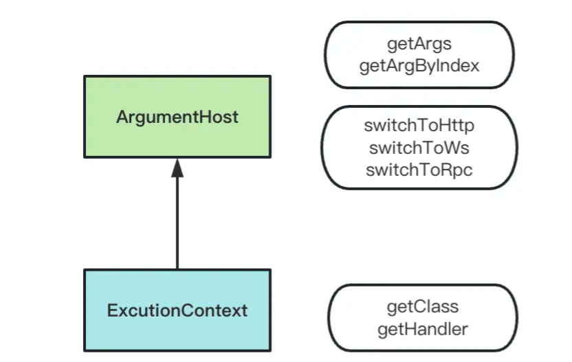

## 执行上下文

Nest 支持创建 HTTP 服务、WebSocket 服务，还有基于 TCP 通信的微服务。这些不同类型的服务都需要 Guard、Interceptor、Exception Filter 功能。但不同类型的服务能拿到的参数是不同的。比如 HTTP 服务可以拿到 request、response 对象，而 WebSocket 服务就没有。

如何让 Guard、Interceptor、Exception Filter 跨多种上下文复用，Nest 的解决方法是 `ArgumentsHost` 和 `ExecutionContext` 类。

### ArgumentsHost

`ArgumentsHost` 类提供了获取传递给处理程序的参数。它允许选择合适的上下文来从框架中获取参数。Nest 提供了 `ArgumentsHost` 的实例，作为 `host` 参数提供给需要获取的地方。例如，异常过滤器中的 `catch` 方法。

`host` 参数的 `getType` 方法可以用来确定当前运行的应用程序类型。

```typescript
@Catch()
export class AllExceptionFilter implements ExceptionFilter {
  catch(exception: HttpException, host: ArgumentsHost) {
    if (host.getType() === 'http') {
      // http context
    } else if (host.getType() === 'rpc') {
      // rpc context
    } else if (host.getType<GqlContextType>() === 'graphql') {
      // graphql context
    }
  }
}
```

获取当前上下文参数，使用 `host` 参数的 `getArgs` 方法。不同的服务类型下，可以获取到不同的参数。

例如，在 `HTTP` 服务下，可以获取到 `req`、`res` 和 `next`。

```typescript
const [req, res, next] = host.getArgs();
```

但这种方式会使应用和特定上下文耦合，更推荐的方法是使用 `host` 参数的应用方法来选择合适的应用上下文。

```typescript
// HttpArgumentsHost
host.switchToHttp();

// WsArgumentsHost
host.switchToWs();

// RpcArgumentsHost
host.switchToRpc();
```

### ExecutionContext

`ExecutionContext` 扩展了 `ArgumentsHost`，提供额外的当前运行线程信息。



Nest 提供了 `ExecutionContext` 的实例，作为 `context` 参数提供给需要获取的地方。例如，守卫中的 `canActivate` 方法和拦截器中的 `intercept` 方法。

```typescript
export class RolesGuard implements CanActivate {
  canActivate(context: ExecutionContext): boolean | Promise<boolean> | Observable<boolean> {
    const ctx = context.switchToHttp();
    return true;
  }
}

export class LoggingInterceptor implements NestInterceptor {
  interceptor(context: ExecutionContext, next: CallHandler): Observable<any> {
    const ctx = context.switchToHttp();
    return next.handle();
  }
}
```

`ExecutionContext` 扩展的 `getClass` 和 `getHandler` 方法可以获取到当前的 class 和 handler。这就为守卫和拦截器提供了极高的灵活性。
