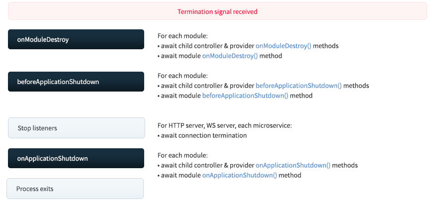

## 生命周期

### 启用

Nest 在启动时会递归解析 Module 依赖，扫描其中的 provider、controller，注入它们的依赖。全部解析完后，才会监听网络端口，开始处理请求。

在这个过程中，Nest 暴露了一些生命周期方法：


首先，递归初始化模块，依次调用模块内的 controller、provider 的`onModuleInit`方法，然后再调用 module 的`onModuleInit`方法。

全部初始化完之后，再依次调用模块内的 controller、provider 的`onApplicationBootstrap`方法，然后调用 module 的`onApplicationBootstrap`方法。

然后监听网络端口。

之后 Nest 应用就正常运行了。

在这个过程中，`onModuleInit`、`onApplicationBootstrap`都是可以实现的生命周期方法并且**支持异步**。

Nest 提供了两个接口`OnModuleInit`和`OnApplicationBootstrap`，可以在 controller、service、module 里分别实现它：

```typescript
@Controller()
export class AppController implements OnModuleInit, OnApplicationBootstrap {
  onModuleInit() {
    console.log('AppController OnModuleInit');
  }

  onApplicationBootstrap() {
    console.log('AppController OnApplicationBootstrap');
  }
}

@Injectable()
export class AppService implements OnModuleInit, OnApplicationBootstrap {
  onModuleInit() {
    console.log('AppService OnModuleInit');
  }

  onApplicationBootstrap() {
    console.log('AppService OnApplicationBootstrap');
  }
}

@Module({
  imports: [],
  controllers: [AppController],
  providers: [AppService],
})
export class AppModule implements OnModuleInit, OnApplicationBootstrap {
  onModuleInit() {
    console.log('AppModule OnModuleInit');
  }

  onApplicationBootstrap() {
    console.log('AppModule OnApplicationBootstrap');
  }
}
```

多模块启动声明周期执行情况：

```shell
UserController OnModuleInit
UserService OnModuleInit
UserModule OnModuleInit
AppController OnModuleInit
AppService OnModuleInit
AppModule OnModuleInit
UserController OnApplicationBootstrap
UserService OnApplicationBootstrap
UserModule OnApplicationBootstrap
AppController OnApplicationBootstrap
AppService OnApplicationBootstrap
AppModule OnApplicationBootstrap
```

### 销毁

Nest 应用销毁时也有同样的生命周期：



首先，调用每个模块的 controller、provider 的`onModuleDestroy`方法，然后调用 module 的`onModuleDestroy`方法。

然后再调用每个模块的 controller、provider 的`beforeApplicationShutdown`方法，然后调用 module 的`beforeApplicationShutdown`方法。

然后停止监听网络端口。

之后调用每个模块的 controller、provider 的`onApplicationShutdown`方法，然后调用 module 的`onApplicationShutdown`方法。

之后停止进程。

在这个过程中，`onModuleDestroy`、`beforeApplicationShutdown`、`onApplicationShutdown`都是可以实现的生命周期方法并且**支持异步**。其中`beforeApplicationShutdown`中可以拿到 **signal（系统信号）**。

Nest 提供了三个接口`OnModuleDestroy`、`BeforeApplicationShutdown`、`OnApplicationShutdown`，可以在 controller、service、module 中分别实现它：

```typescript
@Controller()
export class AppController
  implements OnModuleDestroy, BeforeApplicationShutdown, OnApplicationShutdown
{
  onModuleDestroy() {
    console.log('AppController OnModuleDestroy');
  }

  beforeApplicationShutdown(signal: string) {
    console.log('AppController BeforeApplicationShutdown');
  }

  onApplicationShutdown() {
    console.log('AppController OnApplicationShutdown');
  }
}

@Injectable()
export class AppService
  implements OnModuleDestroy, BeforeApplicationShutdown, OnApplicationShutdown
{
  onModuleDestroy() {
    console.log('AppService OnModuleDestroy');
  }

  beforeApplicationShutdown(signal: string) {
    console.log('AppService BeforeApplicationShutdown');
  }

  onApplicationShutdown() {
    console.log('AppService OnApplicationShutdown');
  }
}

@Module({
  imports: [],
  controllers: [AppController],
  providers: [AppService],
})
export class AppModule
  implements OnModuleDestroy, BeforeApplicationShutdown, OnApplicationShutdown
{
  onModuleDestroy() {
    console.log('AppModule OnModuleDestroy');
  }

  beforeApplicationShutdown(signal: string) {
    console.log('AppModule BeforeApplicationShutdown');
  }

  onApplicationShutdown() {
    console.log('AppModule OnApplicationShutdown');
  }
}
```

多模块销毁生命周期执行情况：

```shell
UserController OnModuleDestroy
UserService OnModuleDestroy
UserModule OnModuleDestroy
AppController OnModuleDestroy
AppService OnModuleDestroy
AppModule OnModuleDestroy
UserController BeforeApplicationShutdown
UserService BeforeApplicationShutdown
UserModule BeforeApplicationShutdown
AppController BeforeApplicationShutdown
AppService BeforeApplicationShutdown
AppModule BeforeApplicationShutdown
UserController OnApplicationShutdown
UserService OnApplicationShutdown
UserModule OnApplicationShutdown
AppController OnApplicationShutdown
AppService OnApplicationShutdown
AppModule OnApplicationShutdown
```
